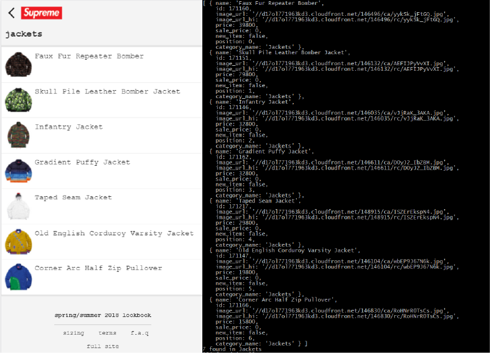

# Supreme API Wrapper
I decided to create a Node.js API for [supremenewyork.com](http://www.supremenewyork.com/), in order to help users keep track of items, that are currently in stock or sold out. This API can be expanded to work with other projects centered around e-commerce, from automatic check out bots, to site monitors. 


## How to install
1. clone or download and run ```npm install ```
2. Where you want to use the API, you must first require it.

```javascript
const options = require('./options')
const api = require('./app');
```

3. You can use the example.js file as a guide for how you can do requests or implement your own way. 

## Features
Requests:
- [x] All Items
- [x] Single Item
- [x] Fetch by Categories
- [x] Fetch by New
- [x] /random/
- [x] Check if Shop is Open

Example to fetch a product. All you have to pass to the API is the product id.

```javascript
api.getItem("171200", (product, stockStatus, err) => {
    if (err) {
        console.log('error: ' + err);
        return err;
    }else{
        console.log(`found item: ${product.ino} and stock count is ${stockStatus}`);
        return product;
    }
});
```

Example to fetch by category. You can change the category from sweatshirts, to any of the 11 categories supreme uses. 

```javascript
api.getAll(options.category.sweatshirts, (product, category, err) => {
    if (err) {
        console.log('error: ' + err);
        return err;
    }else{
        console.log(`${product} found in ${category}`);
    }
});
```




The API sends request using mobile headers. This allows you to be able to accurately retrieve data. 

```javascript
options.uri += '/mobile_stock.json';

async function getProducts() {
    try {
        const response = await axios.get(options.uri, {
            headers: {
                Accept: 'application/json, text/plain, */*',
                'User-Agent': 'Mozilla/5.0 (iPhone; CPU iPhone OS 9_1 like Mac OS X) AppleWebKit/601.1.46 (KHTML, like Gecko) Version/9.0 Mobile/13B143 Safari/601.1'
            }
        });
        let categoryData = response.data.products_and_categories[`${category}`];
        callback(categoryData.length, category)
    } catch (error) {
        console.error(error)
        callback(null, null, error)
    }
}
getProducts()
```


## Future Improvements
* Watch certain items function
* watch a category
* POST request for certain items

## Contribution
Want to make a contribution? Fork the repo, add your changes, and submit a pull request. Any type of contributions (ideas, bug fixes, fixing typos, etc.) will be appreciated!


## License
supreme-api-wrapper is licensed under [MIT License](https://github.com/KanteLabs/supreme-api-wrapper/blob/master/LICENSE).
